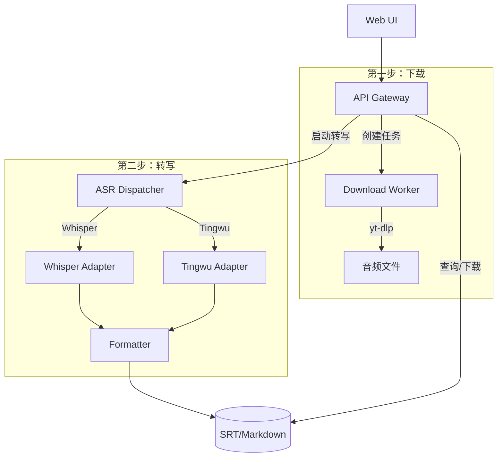

# Podscript MVP

一个用于播客/音视频链接的转写演示项目。提供任务创建、状态查询与结果下载（SRT/Markdown），采用模块化架构，便于独立开发与测试。

## 主要特性

- **下载与转写分离**：音频下载和语音转写为独立步骤，支持灵活组合
- **双转写引擎**：支持 Whisper 离线转写和阿里云通义听悟在线转写
- **多模型选择**：Whisper 提供 6 种模型，按需选择速度与精度
- **实时进度**：转写过程实时显示进度和日志

## 快速开始

### 环境准备

```bash
# 创建并激活虚拟环境
python3 -m venv .venv && source .venv/bin/activate

# 安装依赖
pip install -r requirements.txt

# 安装 ffmpeg（必需）
brew install ffmpeg  # macOS
# apt install ffmpeg  # Ubuntu
```

### 运行服务

```bash
# 启动 API 服务（默认端口 8001）
PYTHONPATH=./src uvicorn podscript_api.main:app --port 8001

# 改变了代码之后，添加--reload
PYTHONPATH=./src uvicorn podscript_api.main:app --port 8001 --reload
# 访问 Web UI
open http://localhost:8001/
```

### 运行测试

```bash
PYTHONPATH=./src pytest --disable-warnings --maxfail=1 \
  --cov=src/podscript_api --cov=src/podscript_pipeline --cov=src/podscript_shared \
  --cov-report=term-missing
```

## 转写引擎

### Whisper 离线（推荐）

OpenAI 开源的语音识别模型，完全本地运行，无需网络和 API 密钥。

**安装：**
```bash
pip install openai-whisper
```

**可用模型：**

| 模型 | 参数量 | 显存需求 | 相对速度 | 适用场景 |
|------|--------|----------|----------|----------|
| tiny | 39M | ~1GB | ~10x | 快速测试 |
| base | 74M | ~1GB | ~7x | 日常使用（推荐） |
| small | 244M | ~2GB | ~4x | 较高精度 |
| medium | 769M | ~5GB | ~2x | 高精度 |
| large | 1550M | ~10GB | 1x | 最高精度 |
| turbo | 809M | ~6GB | ~8x | 速度与精度平衡 |

**首次使用**：选择模型后会自动下载，也可通过"下载模型"按钮预下载。

### 阿里云通义听悟

阿里云在线转写服务，需配置阿里云账号。

**配置步骤：**
1. 创建阿里云 RAM 用户并获取 AccessKey
2. 开通通义听悟服务并获取 AppKey
3. 创建 OSS Bucket 用于临时存储音频
4. 在 `.env` 中配置（见下方配置章节）

## 使用方式

### Web UI（推荐）

1. 启动服务后访问 `http://localhost:8001/`
2. **第一步：下载音频**
   - 输入 YouTube 链接，点击"开始下载"
   - 或直接上传本地音/视频文件
3. **第二步：开始转写**
   - 选择转写引擎（Whisper 离线 / 通义听悟）
   - 选择 Whisper 模型（如使用 Whisper）
   - 点击"开始转写"
4. 查看实时进度和日志
5. 完成后下载 SRT 或 Markdown 结果

### API 调用

**两步式工作流：**

```bash
# 第一步：创建下载任务
curl -X POST -H 'Content-Type: application/json' \
  -d '{"source_url":"https://www.youtube.com/watch?v=..."}' \
  http://localhost:8001/tasks
# 返回：{"id": "abc123", "status": "queued", ...}

# 等待下载完成，查询状态
curl http://localhost:8001/tasks/abc123
# 返回：{"status": "downloaded", ...}

# 第二步：启动转写（使用 Whisper base 模型）
curl -X POST "http://localhost:8001/tasks/abc123/transcribe?provider=whisper&model_name=base"
# 返回：{"status": "transcribing", ...}

# 等待转写完成
curl http://localhost:8001/tasks/abc123
# 返回：{"status": "completed", ...}

# 获取结果
curl http://localhost:8001/tasks/abc123/results
# 返回：{"srt_url": "/artifacts/abc123/result.srt", "markdown_url": "..."}
```

**上传本地文件：**

```bash
# 上传文件（自动标记为 downloaded 状态）
curl -X POST -F "file=@audio.mp3" http://localhost:8001/tasks/upload
# 返回：{"id": "def456", "status": "downloaded", ...}

# 启动转写
curl -X POST "http://localhost:8001/tasks/def456/transcribe?provider=whisper&model_name=turbo"
```

**查询转写引擎和模型：**

```bash
# 获取可用转写引擎
curl http://localhost:8001/asr/providers

# 获取 Whisper 模型列表（含下载状态）
curl http://localhost:8001/asr/whisper/models

# 下载指定模型
curl -X POST -H 'Content-Type: application/json' \
  -d '{"model_name":"base"}' \
  http://localhost:8001/asr/whisper/download
```

## 配置（.env）

### Whisper 离线模式（无需配置）

Whisper 模式开箱即用，无需任何配置。

### 通义听悟模式

在项目根目录创建 `.env` 文件：

```env
# 阿里云 AccessKey
ALIBABA_CLOUD_ACCESS_KEY_ID=your-ak-id
ALIBABA_CLOUD_ACCESS_KEY_SECRET=your-ak-secret

# 通义听悟 AppKey
TINGWU_APP_KEY=your-tingwu-app-key
TINGWU_ENABLED=1

# OSS 配置（用于临时存储音频）
STORAGE_PROVIDER=oss
STORAGE_BUCKET=your-oss-bucket
STORAGE_REGION=cn-shanghai

# 产物目录
ARTIFACTS_DIR=artifacts
```

> 不要将 `.env` 提交到 Git

## 目录结构

```
src/
├── podscript_api/          # API 网关与 Web UI
│   ├── main.py             # FastAPI 应用入口
│   └── static/             # 前端静态文件
├── podscript_pipeline/     # 处理管线
│   ├── download.py         # 音频下载（yt-dlp）
│   ├── preprocess.py       # 音频预处理
│   ├── asr.py              # ASR 调度层
│   ├── whisper_adapter.py  # Whisper 离线转写
│   ├── tingwu_adapter.py   # 通义听悟在线转写
│   └── formatters.py       # 结果格式化
└── podscript_shared/       # 共享模型与配置
    ├── models.py           # Pydantic 模型
    └── config.py           # 配置加载

tests/                      # 测试用例
docs/                       # 文档
```

## 架构图



## 测试与质量

- 覆盖率门槛：≥80%
- 本地验证：按"快速开始"运行测试与服务

## 常见问题

### Whisper 相关

**Q: 首次转写很慢？**
A: 首次使用需下载模型（约 140MB-3GB），之后会缓存到 `~/.cache/whisper/`

**Q: 显存不足？**
A: 选择较小的模型（tiny/base），或确保有足够 GPU 显存

**Q: 没有 GPU？**
A: Whisper 支持 CPU 运行，但速度较慢。建议使用 tiny 或 base 模型

### 下载相关

**Q: YouTube 下载失败？**
A:
- 确保已安装 `yt-dlp` 和 `ffmpeg`
- 部分视频可能有地区限制
- 如遇"Sign in to confirm you're not a bot"，需配置浏览器 Cookie

**Q: 支持哪些视频平台？**
A: 支持 yt-dlp 所支持的所有平台（YouTube、Bilibili 等）

### 转写相关

**Q: 转写按钮无法点击？**
A: 需先完成第一步（下载或上传文件），状态变为"downloaded"后才能转写

**Q: 转写结果不准确？**
A:
- 使用更大的 Whisper 模型（medium/large）
- 确保音频质量清晰
- 对于中文，推荐使用多语言模型（不带 .en 后缀）

## 故障排查

### 端口已被占用
```bash
# 查看占用进程
sudo lsof -nP -iTCP:8001 | grep LISTEN
# 杀死进程
kill -9 <PID>
# 或使用其他端口
PYTHONPATH=./src uvicorn podscript_api.main:app --port 8002
```

### 模块导入失败
```bash
# 确保设置 PYTHONPATH
export PYTHONPATH=./src
# 或在命令前添加
PYTHONPATH=./src uvicorn ...
```

### OSS 签名错误
- 检查 AccessKey ID/Secret 是否正确
- 确认 `STORAGE_REGION` 与 Bucket 所在区域一致
- 系统时间需与网络时间同步

## 相关链接

- [OpenAI Whisper](https://github.com/openai/whisper)
- [阿里云通义听悟](https://help.aliyun.com/zh/tingwu/)
- [阿里巴巴 SDK 中心-听悟](https://api.aliyun.com/api-tools/sdk/tingwu?version=2023-09-30&language=python-tea&tab=primer-doc)    
- [听悟 OpenAPI-文档](https://next.api.aliyun.com/api/tingwu/2023-09-30/GetTaskInfo?lang=PYTHON)
- 听悟[官方文档](https://help.aliyun.com/zh/tingwu/getting-started-1?spm=a2c4g.11174283.0.0.7e93607e4uJv0r)，尤其是开通tingwi_app_key
- [tingwu-20230930 Github-地址](https://github.com/aliyun/alibabacloud-python-sdk/tree/master/tingwu-20230930)
- [阿里云 RAM 用户创建](https://help.aliyun.com/zh/ram/user-guide/create-an-accesskey-pair)
- [yt-dlp 文档](https://github.com/yt-dlp/yt-dlp)
