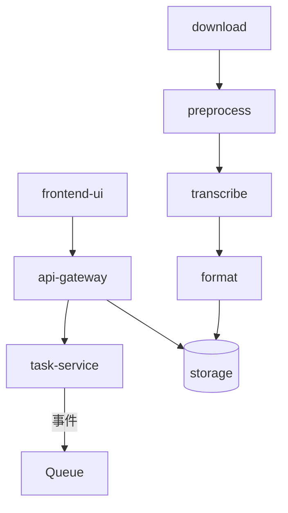

# 模块化架构设计

- 前端：`frontend-ui`（MVP 由 API 网关提供静态文件接口替代）
- 网关：`podscript_api`（FastAPI）
- 管线：`podscript_pipeline`（下载/预处理/转写/格式化）
- 共享：`podscript_shared`（模型/配置）

## 性能与质量
- 响应时间：同步路径≤500ms（创建任务/查询状态）
- 错误率：统一重试与错误码；观测指标采集
- 并发：初期并发≥10，可增 worker 进行水平扩展